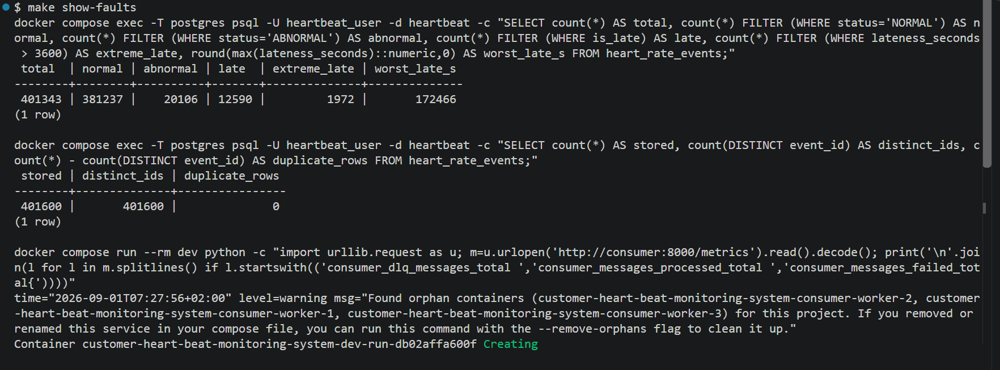
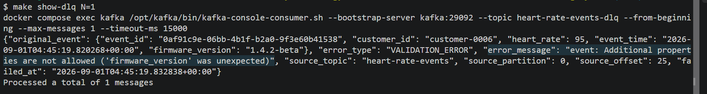
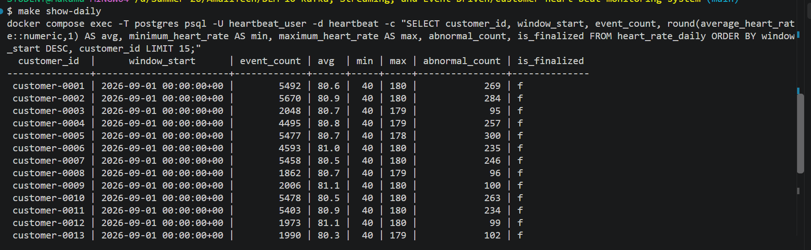
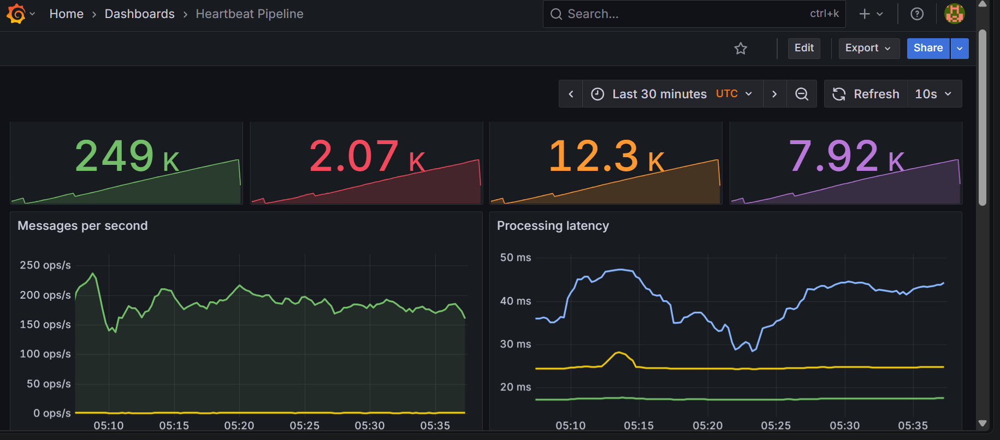
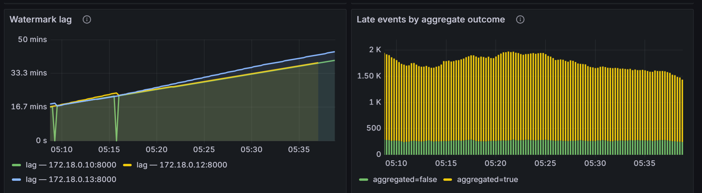
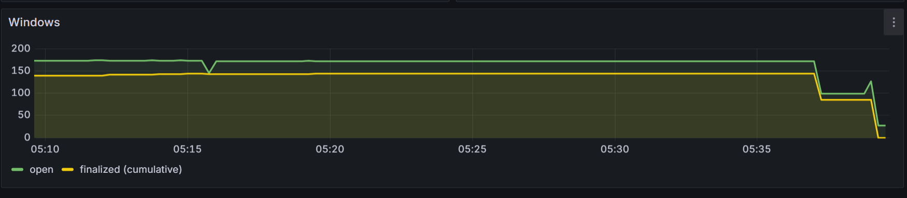

# Real-Time Customer Heartbeat Monitoring System

Simulated heart-rate sensors → Kafka → event-time stream processing with
watermarks and 1-day tumbling windows → PostgreSQL, with Prometheus and
Grafana for observability.

## Overview

> "I built a real-time pipeline that ingests simulated heart-rate sensor
> readings through Kafka, processes them in **event time** with
> watermarks and one-day tumbling windows, and stores both raw readings
> and daily per-customer aggregates in PostgreSQL. Invalid events go to
> a dead letter queue instead of being dropped. Prometheus alert rules
> feed Alertmanager, and every operational alert is recorded in
> PostgreSQL with a firing-and-resolved lifecycle. The whole stack runs
> in Docker with a provisioned Grafana dashboard. 125 automated tests,
> 96 unit and 29 integration."


> "The hard part of a streaming system isn't moving bytes — it's dealing
> with the fact that **events arrive out of order**. A sensor reading
> that happened at 10:00 might reach us at 10:08. If you aggregate by
> arrival time you put it in the wrong day's bucket and your numbers are
> silently wrong.
>
> So the system processes by *event time* — when the heartbeat actually
> happened. A watermark tracks how far event time has progressed and
> decides when a window can safely close. Late events within a grace
> period still update the correct window. Events arriving after a window
> closes are still stored raw, but they don't retroactively change a
> finalized aggregate — that's a deliberate policy so historical numbers
> stay stable.
>
> I also separated two ideas that look similar: **abnormal is not
> invalid**. A heart rate of 180 is medically abnormal but structurally
> valid, so it's stored and tagged. Only structurally broken events —
> bad UUID, out-of-range value, missing field — go to the dead letter
> queue, with enough context to diagnose them."

**Everything runs in Docker.**

```bash
make up      # start the whole stack
make urls    # every dashboard URL and credential
make help    # every target
```

---

## Quick start

```bash
cp .env.example .env   # optional, every value has a default
make up
make urls
```

| Service | URL | Credentials |
| --- | --- | --- |
| **Grafana** dashboards | http://localhost:3000 | `admin` / `admin_password` |
| **Adminer** (PostgreSQL) | http://localhost:8080 | server `postgres`, db `heartbeat`, user `heartbeat_user`, pass `heartbeat_password` |
| **Prometheus** | http://localhost:9090 | — |
| **Alertmanager** | http://localhost:9093 | — |
| Consumer metrics | http://localhost:8000/metrics | — |
| Notifier health | http://localhost:9091/health | — |

`make adminer`, `make grafana`, `make prometheus` print the URL and
credentials for each. Grafana's dashboard (**Heartbeat Pipeline**,
9 panels) and its datasource are provisioned automatically — nothing to
click.

---

## Technology choices

| Choice | Why |
| --- | --- |
| Kafka 4.0, **KRaft** | Durable replayable partitioned log.|
| **Python** consumer, no Flink | The windowing and watermark logic is the learning objective|
| PostgreSQL 17 | Indexed time-series storage with the `ON CONFLICT` upsert idempotency needs |
| Prometheus + Grafana | Application metrics belong in a time-series store, not the operational database |
| JSON Schema | One machine-checkable definition of a valid event |

Kafka runs two listeners — `kafka:29092` for containers, `localhost:9092`
for the host. A single listener cannot serve both: a container told to
reconnect to `localhost` would dial itself.

Topics are created by a `kafka-init` service that runs once and exits;
app services gate on it, and auto-creation is off.

| Topic | Partitions | Replication | Retention |
| --- | --- | --- | --- |
| `heart-rate-events` | 3 | 1 | 7 days |
| `heart-rate-events-dlq` | 3 | 1 | 30 days |

---

## Event schema

[`schemas/heart_rate_event.json`](schemas/heart_rate_event.json) is the
single source of truth, loaded and enforced at runtime.

```json
{
  "event_id": "3f2b1c94-...",
  "customer_id": "customer-0001",
  "heart_rate": 75,
  "event_time": "2026-08-30T10:00:00+00:00"
}
```

`event_id` is a UUID and the primary key. `customer_id` is the Kafka
partition key, so a customer's events stay ordered on one partition.
`heart_rate` is an integer 20–250. `event_time` needs a timezone offset.
Unknown fields are rejected.

**Abnormal is not invalid.** 45 or 180 bpm is stored and tagged
`ABNORMAL`. Only structurally broken events are dead-lettered.

---

## Testing the pipeline.

| Fault | Default rate | Models |
| --- | --- | --- |
| Abnormal reading | 5% | Valid event outside 60–100 bpm |
| Out of order | 5% | `event_time` backdated up to 10 min |
| Extreme late | 0.5% | Device offline for ~2 days, then synced |
| Out of range | 0.4% | Malfunctioning sensor, violates the schema |
| Invalid payload | 0.4% | Buggy device: bad UUID, missing field, wrong type |
| Duplicate | 1% | Device retrying a send it already made |

One command shows what the pipeline handled:

```bash
make show-faults
```



From a sustained run of ~400,000 events:

```
 total  | normal | abnormal | late  | extreme_late | worst_late_s
 401343 | 381237 |    20106 | 12590 |         1972 |       172466

 stored | distinct_ids | duplicate_rows
 401600 |       401600 |              0
```

Three things are checkable from those numbers alone. Abnormal is **5.0%**
of the total, against a configured `SIMULATOR_ABNORMAL_PROBABILITY=0.05`
— the classifier agrees with what the simulator emitted. Worst lateness
of 172,466s is **~48 hours**, the extreme-late fault modelling a device
that was offline for two days and has just synced. And `duplicate_rows`
is **0** across 401,600 stored events despite a 1% duplicate rate.

The two queries ran seconds apart while ingestion continued, which is
why the second reports 401,600 rows against the first's 401,343.

### On-demand injection

`make inject WHAT=<case>` fires one specific case immediately, for when
you need to demonstrate rather than wait for probability:

```bash
make inject WHAT=future        # +3d → advances watermark, closes windows
make inject WHAT=toolate       # -2d → raw kept, finalized window untouched
```

`WHAT` also accepts `normal`, `abnormal`, `invalid`, `outofrange`,
`late` and `duplicate`, though the simulator already produces all six.

The two above are **the only cases that cannot be automated**:

- **`future`** is not sensor behaviour. It is a tool for jumping the
  watermark so windows finalize inside a demo instead of after a real
  day. Making it probabilistic would repeatedly finalize open windows
  early and push every later event past the grace period — it would
  corrupt the aggregates rather than exercise them.
- **`toolate`, the finalized-window case,** needs a window that is *already*
  finalized. The simulator's extreme-late events produce huge lateness,
  but if their window was never opened the aggregator simply opens it,
  so `aggregated=false` cannot be produced reliably by chance. The
  `future` → `toolate` sequence is what demonstrates it.

Inspect the result:

```bash
make show-faults    # what the simulator produced and how it was handled
make show-raw       # recent events with status, is_late, lateness
make show-daily     # daily aggregates, open and finalized
make show-late      # late count and worst lateness
make show-dlq N=3   # read the dead letter topic
make reconcile      # aggregates vs raw counts
make metrics        # raw Prometheus metrics
make throughput     # rates, latency percentiles, watermark lag
```

### Walkthroughs for each guarantee

**Invalid → DLQ, and nothing reaches PostgreSQL**

```bash
make show-dlq N=1
```



The DLQ already has entries — the simulator emits malformed payloads
continuously. No injection needed.

```json
{
  "original_event": {
    "event_id": "0af91c9e-06bb-4b1f-b2a0-9f3e60b41538",
    "customer_id": "customer-0006",
    "heart_rate": 95,
    "event_time": "2026-09-01T04:45:19.820268+00:00",
    "firmware_version": "1.4.2-beta"
  },
  "error_type": "VALIDATION_ERROR",
  "error_message": "event: Additional properties are not allowed ('firmware_version' was unexpected)",
  "source_topic": "heart-rate-events",
  "source_partition": 0,
  "source_offset": 25,
  "failed_at": "2026-09-01T04:45:19.832838+00:00"
}
```

That captured event is the interesting case: the heart rate is 95,
perfectly normal, and every required field is present. It was rejected
purely for carrying an **extra** field — `"additionalProperties": false`
catching a device that shipped a firmware field the contract never
agreed to. A range check would have waved it through.

The payload carries the schema's own message, the original event, and
the source topic / partition / offset, so it can be replayed once the
contract is updated. The offset is committed **only after** the DLQ
write is acknowledged — if the DLQ fails, Kafka redelivers rather than
dropping.

**Late events are detected and measured**

```bash
make show-late
```

A non-zero late count is the real proof: it requires `event_time` to be
genuinely backdated, not merely delivered late.

**Windows finalize, then become immutable**



One row per `(customer_id, window_start)` on the 1-day tumbling window,
`is_finalized = f` because the watermark has not yet passed
`window_end + ALLOWED_LATENESS_SECONDS`. That is the point of
snapshotting open windows — today is queryable before it closes. Note
`min` 40 and `max` ~180 sitting inside an ~80.7 bpm average: the
abnormal readings are in the aggregate, tagged rather than dropped.

```bash
make show-daily                 # note event_count for customer-0001
make inject WHAT=future         # jump the watermark 3 days ahead
make show-daily                 # windows now is_finalized = true
make inject WHAT=toolate        # 240 bpm into the closed window
make show-raw                   # stored, is_late = true
make show-daily                 # aggregate UNCHANGED
```

**Idempotency under at-least-once delivery**

```bash
make show-faults   # duplicate_rows is 0 despite a 1% duplicate rate
```

**Aggregates reconcile with raw data**

```bash
docker compose stop producer    # let one flush interval pass
make reconcile                  # every open window: reconciles = t
docker compose start producer
```

Two things make this check meaningful only under those conditions:

- Stop the producer first. While it runs, the open-window snapshot
  legitimately trails the raw table by up to
  `WINDOW_FLUSH_INTERVAL_SECONDS`.
- `make reconcile` compares **open windows only**. A finalized window is
  immutable, so events arriving after it closed are stored raw and
  deliberately excluded from the aggregate. Comparing global totals
  after any window has finalized would report a mismatch that is in fact
  the policy working correctly.

**State survives a consumer restart**

```bash
make reconcile
docker compose restart consumer
make consumer          # look for window state being reloaded
make reconcile         # still reconciles, not reset to a partial
```

**Scaling and partition assignment**

```bash
make load-up RATE=1000 CONSUMERS=2
make lag               # per-partition lag and which consumer owns what
make throughput SAMPLE=90
make load-down
```

With 3 partitions and 4 consumers, one consumer is assigned zero
partitions and idles — partition count is the ceiling on useful
parallelism. Measured numbers below.

### Automated tests

```bash
make test               # 96 unit tests, no stack needed
make test-integration   # 29 integration tests, needs `make up`
make test-all
make lint
```

Integration tests run the real consumer against real Kafka and
PostgreSQL. They are isolated from the running
pipeline on both axes — their own topics per test, their own PostgreSQL
schema built from the real DDL — so a test run cannot corrupt live
aggregates and the live pipeline cannot skew a test.

---

## Performance and scaling

```bash
make load-up RATE=1000 CONSUMERS=2
make throughput SAMPLE=90    # sample once rates settle
make lag                     # per-partition lag and ownership
make load-down
```

`RATE` is simulator events/sec. `CONSUMERS` is *additional* workers
joining the group — the base `consumer` service is always present, so
total instances = `CONSUMERS + 1`. Always pass `SAMPLE`: containers are
recreated on `load-up`, and both Prometheus DNS discovery and the
1-minute `rate()` window need time to settle. Measuring immediately
reports numbers that are far too low.

Measured on a single Docker Desktop host, Windows 11, Kafka 4.0 KRaft
single broker, 3 partitions, PostgreSQL 17. All services share one
machine, so these figures are relative, not absolute capacity.

| Test | Rate | Consumers | Achieved input/s | Processed/s | p50 | p95 | p99 | Lag behaviour |
| --- | --- | --- | --- | --- | --- | --- | --- | --- |
| Baseline | 1 | 1 | 1.0 | 1.0 | 21.9ms | 47.0ms | 49.8ms | Stable at ~0 |
| Test 1 | 100 | 2 | 100 | 110 | 17.4ms | 24.5ms | 36.0ms | Drains backlog |
| Test 2 | 1,000 | 3 | 1,000 | 195 | 17.5ms | 24.5ms | 36.7ms | Grows ~800/s |
| Test 3 | 5,000 | 4 | ~3,450 | 206 | 17.5ms | 24.5ms | 36.2ms | Grows ~3,250/s |

### Where the bottleneck is

**The consumer, at roughly 57–65 events/sec per instance.**

p50 processing time is 17.5ms and essentially flat across every rate.
`1 / 0.0175 ≈ 57/s`, which matches measured per-instance throughput.
Latency *not* degrading under load is the tell: the consumer is not
contended, it is serialised. Each event costs two synchronous round
trips — `insert_event` runs an `INSERT` then `connection.commit()`, and
`consumer.commit()` synchronously commits the Kafka offset. Both are per
event, so throughput is bounded by round-trip latency rather than by
CPU, Kafka, or PostgreSQL capacity.

A second, separate ceiling sits in the **producer** at ~3,450/s, which
is why Test 3 never reached 5,000: generation, JSON encoding and the
`simulator | producer` pipe are all single-threaded Python. Before this
phase there was a third and much lower ceiling — the producer waited for
each message's acknowledgement with `future.get()`, capping input near
`1 / linger_ms` ≈ 20/s. `KAFKA_SYNC_SEND=false`, set by the load
overlay, removes it.

**Does Kafka accumulate messages?** Yes, and that is the design working.
Kafka ingested ~3,450/s without difficulty while consumers drained
~206/s, so lag is purely a consumer-side deficit. At 1,000/s with 3
consumers, lag reached ~98,000 in about 2 minutes.

**Does PostgreSQL become the bottleneck?** Not by capacity. Single-row
inserts are trivial for PostgreSQL 17; the cost is the per-event
transaction commit. Batching would move this ceiling substantially, at
the price of the current per-event durability guarantee.

### Partitions versus consumers

Partition count is the hard ceiling on useful consumers in a group.

| Instances | Processed/s | Per instance |
| --- | --- | --- |
| 1 | ~60 | 60 |
| 2 | 110 | 55 |
| 3 | 195 | 65 |
| 4 | 206 | 52 |

**3 partitions, 2 consumers** — assignment is uneven, and so is load.
Worker A holds partitions 0 and 1 (lag 805 and 1,107) and falls behind;
worker B holds partition 2 (lag 1) and keeps pace. Aggregate throughput
is limited by the busiest member.

**3 partitions, 3 consumers** — one partition each, evenly balanced.
This produced the best per-instance figures.

**3 partitions, 4 consumers** — the fourth gets nothing:

```
CONSUMER-ID                              #PARTITIONS
kafka-python-3.0.11-74c0d180-...              1
kafka-python-3.0.11-5294d0d5-...              1
kafka-python-3.0.11-53d48fc3-...              1
kafka-python-3.0.11-7fe1cbc7-...              0
```

It joins the group, is assigned zero partitions, and idles. Throughput
rose only 195 → 206/s, within measurement noise. To scale past 3
consumers, raise `KAFKA_TOPIC_PARTITIONS` and recreate the topic.

### Correctness under scaling

Two properties make horizontal scaling safe. Events are keyed by
`customer_id`, so all of a customer's events land on one partition and
therefore one consumer — a customer's window state is never split across
instances. And window state is loaded lazily, per key, on the first
event for that window (`repository.load_window`). An earlier eager
implementation loaded *every* unfinalized window at startup, which under
scaling meant each worker held state for customers it did not own and
re-persisted stale values over its peers' aggregates.

### Known limits

- Figures come from one shared host; absolute numbers will differ
  elsewhere. The *ratios* and the identified bottleneck are the result.
- CPU and memory were not captured per container.
- 5,000/s was not reached on the input side, so the consumer's ceiling
  above ~206/s aggregate is untested.
- Raising throughput meaningfully means batching offset commits and
  inserts, which trades away per-event durability. Not attempted — the
  current guarantee is the one the design calls for.

---

## How the stream processing works

**Watermark** — `max_event_time_seen − ALLOWED_OUT_OF_ORDERNESS_SECONDS`.
Moves forward, never backward, derived from event time only. An event is
never late relative to itself: lateness is judged against the watermark
*before* that event was applied. `consumer_watermark_lag_seconds` sits
at roughly the configured out-of-orderness on a healthy stream.

**Windows** — 1-day tumbling, `00:00 → 24:00` UTC, non-overlapping,
assigned from `event_time`. State is held in memory per
`(customer_id, window_start)` and written to `heart_rate_daily`. Open
windows are snapshotted every `WINDOW_FLUSH_INTERVAL_SECONDS` with
`is_finalized = false`, so today is queryable before it closes. A window
finalizes once the watermark passes `window_end + ALLOWED_LATENESS_SECONDS`.

**Late events** — three outcomes:

| Arrival | Raw row | Aggregate |
| --- | --- | --- |
| On time, or within allowed out-of-orderness | Stored, `is_late=false` | Updated |
| Late, window still open | Stored, `is_late=true`, lateness recorded | Updated — correct window, by event time |
| Past allowed lateness, window finalized | Stored, `is_late=true`, lateness recorded | **Unchanged** |

Raw data is never discarded; a finalized window is immutable. Late
events are never treated as invalid and never reach the DLQ — lateness
is a timing property, not a validity one.

The simulator creates genuinely out-of-order events by **backdating
`event_time`**. Delaying delivery alone would not work: `event_time`
would still increase monotonically, so nothing could ever be late.

**Restart** — offsets commit as events are processed, so a restarted
consumer never re-reads them. Window state is reloaded from PostgreSQL
lazily, on the first event for each window. Lazy loading is what makes
scaling safe: a worker only owns windows it actually receives events
for.

---

## Monitoring

`consumer_messages_processed_total`,
`consumer_messages_failed_total{reason}`, `consumer_dlq_messages_total`,
`consumer_abnormal_events_total`,
`consumer_late_events_total{aggregated}`,
`consumer_processing_seconds` (histogram),
`consumer_watermark_lag_seconds`, `consumer_windows_open`,
`consumer_windows_finalized_total`.

Prometheus discovers consumers by DNS, so scraping follows replicas when
scaled.

### The dashboard

Grafana's **Heartbeat Pipeline** dashboard is provisioned automatically
— 9 panels, no clicking. Captured below under sustained load, on a
30-minute window with a 10s refresh.



The four stat tiles read 249K processed, 2.07K dead-lettered, 12.3K
abnormal and 7.92K late. Two of those ratios double as checks on the
pipeline rather than decoration:

- DLQ is **0.83%** of processed — the baseline `DLQRateHigh` was set
  against, and the reason that rule is a proportion rather than an
  absolute rate.
- Abnormal is **4.9%** of processed, against a configured 5%.

**Messages per second** holds ~150–200 ops/s with `failed/sec` flat on
zero. **Processing latency** shows p50 ~18ms, p95 ~23ms, p99 fluctuating
30–45ms — the measured basis for `ProcessingLatencyHigh` firing at
500ms, roughly 20× the normal p95.



**Watermark lag** carries one series per consumer instance
(`172.18.0.10`, `.12`, `.13`) — three replicas from a scaled run, which
is the DNS scrape discovery following replicas rather than being
configured by hand. The lines track each other closely, so every replica
shares a consistent view of event-time progress.

The lag climbs to ~45 minutes here rather than resting at the ~300s idle
baseline. That is the backlog under load, and it is the honest reading:
the producer is running well above the per-consumer processing rate, so
event time falls further behind wall-clock the longer the run goes.
`WatermarkStuck` would fire in this state, correctly. The two sharp
drops to zero early on are one instance resetting its in-memory
watermark and rebuilding — what a consumer restart looks like here.

**Late events by aggregate outcome** is the late-event policy as a
graph. `aggregated=true` dominates: late events still landing in an open
window and correctly updating it. The thin, steady `aggregated=false`
band underneath is the extreme-late fault arriving past the grace
period. Both are stored raw; only the second is excluded from its
aggregate.



`open` sits at ~170 windows against ~140 cumulative `finalized` for most
of the run, then both fall to near zero at the end as the consumers stop
and their in-memory state goes away. `open` tracking above `finalized`
throughout is the lazy per-window reload working — a worker holds state
only for the windows it actually receives events for.

---

## Notifications

```
Prometheus → alert rules → Alertmanager → notifier → notifications table
```

Alerts cover **operational failures, not clinical anomalies**. An
abnormal heart rate is valid business data, already stored and tagged.
A dead consumer is not.

| Alert | Fires when | For | Severity |
| --- | --- | --- | --- |
| `ConsumerDown` | No healthy consumer instance | 1m | CRITICAL |
| `PostgresUnavailable` | Notifier cannot reach PostgreSQL | 1m | CRITICAL |
| `KafkaLagHigh` | Consumer group lag > 10,000 | 5m | WARNING |
| `ProcessingLatencyHigh` | p95 processing > 500ms | 5m | WARNING |
| `DLQRateHigh` | > 5% of events dead-lettered | 5m | WARNING |
| `WatermarkStuck` | Watermark lag > 900s | 10m | WARNING |

Thresholds are set against the measured baselines in
[Performance and scaling](#performance-and-scaling), not guessed — p95
is normally ~25ms, watermark lag sits at ~300s when idle, and the DLQ
baseline is ~0.8% of traffic. DLQRateHigh is a proportion rather than an absolute rate, so
it does not false-fire simply because throughput rose.

Every alert is recorded in PostgreSQL with a firing/resolved lifecycle,
so the system can answer *"show me every notification in the last 30
days."*

```bash
make alerts               # rules and their current state
make show-notifications   # alert history
make alert-demo           # stop the consumer, watch ConsumerDown fire and resolve
```

```sql
SELECT alert_type, severity, status, created_at, resolved_at
FROM notifications
WHERE created_at > now() - interval '30 days'
ORDER BY created_at DESC;
```

Alertmanager is at http://localhost:9093, the notifier at
http://localhost:9091/health.

**The notifier is a separate service on purpose.** `ConsumerDown` is one
of the alerts, so a recorder inside the consumer would die alongside the
thing it reports on. It also probes PostgreSQL independently, which is
where `PostgresUnavailable` gets its signal.

To add Slack or email, uncomment the receiver stub in
[config/alertmanager/alertmanager.yml](config/alertmanager/alertmanager.yml)
and put the webhook URL in your own `.env`. Nothing outbound is
configured by default.

---

## CI/CD

[`.github/workflows/ci.yml`](.github/workflows/ci.yml):

```
push / PR
  ├── quality      lint → unit tests → docker build
  └── integration  start stack → wait for first event → full pipeline
```

CI uses the same `make` targets you run locally, so it cannot drift.

---

## Configuration

Everything is environment-driven — see [.env.example](.env.example).
Nothing needs a source edit, including event rate, out-of-order
probability, watermark lag, allowed lateness, and flush interval.

## Layout

```
simulator/   Synthetic event generation
producer/    Kafka publishing
consumer/    Validation, classification, event time, windowing, persistence
notifier/    Alertmanager webhook sink, PostgreSQL health probe
schemas/     JSON Schema — the event contract
database/    Numbered DDL, applied automatically on first start
config/      Prometheus scrape config, Grafana provisioning
tests/       Unit tests, plus tests/integration against the live stack
scripts/     inject.py (crafted events), measure.py (throughput sampling)
docs/        Architecture (PlantUML), diagrams, screenshots
```
