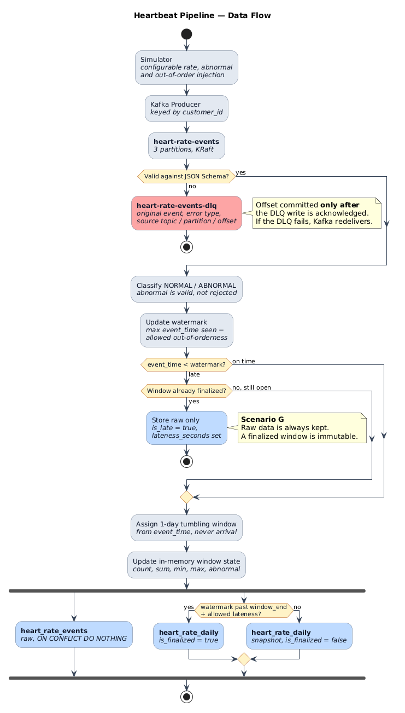
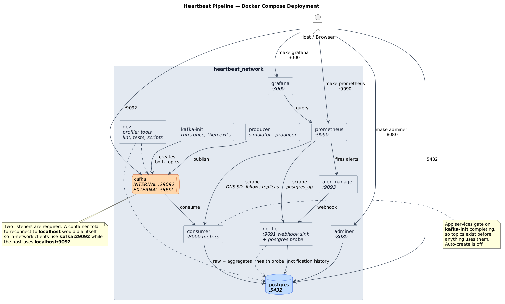

# Architecture



## Component responsibilities

| Component | Owns | Does not own |
| --- | --- | --- |
| `simulator/` | Event generation, rate, abnormal and out-of-order injection | Kafka; it writes JSON to stdout only |
| `producer/` | Publishing, partition keying, delivery acknowledgement | Event content or validity |
| `consumer/validation.py` | Structural validity, judged against the JSON Schema | Whether a reading is clinically normal |
| `consumer/anomaly.py` | NORMAL / ABNORMAL classification | Rejecting anything |
| `consumer/watermark.py` | How far event time has progressed | Window assignment |
| `consumer/windows.py` | Mapping an event time to its 1-day window | Aggregation |
| `consumer/window_state.py` | Accumulating one window's statistics | Window lifecycle |
| `consumer/aggregator.py` | Window lifecycle, lateness verdicts, finalization | Persistence |
| `consumer/repository.py` | All SQL, idempotency, upserts | Business rules |
| `consumer/dlq.py` | Publishing failures with diagnostic context | Deciding what is a failure |
| `consumer/retry.py` | Bounded exponential backoff with jitter | Classifying errors |
| `notifier/payload.py` | Turning Alertmanager webhooks into records | Persistence or transport |
| `notifier/store.py` | Persisting alerts, buffering when PostgreSQL is unreachable | Deciding what is an alert |
| `notifier/probe.py` | Independent PostgreSQL health signal | Anything else |
| `notifier/server.py` | The webhook endpoint and metrics exposition | Alert semantics |

The split that matters most: **abnormal is not invalid.** A 180 bpm
reading is structurally valid and must be stored and tagged. Only
structurally broken events are dead-lettered.

## Failure paths

| Failure | Handling | Offset committed? |
| --- | --- | --- |
| Schema violation, bad UUID, bad timestamp | Published to DLQ with error type, message, source topic/partition/offset | Only after the DLQ write succeeds |
| DLQ publish fails | Exception propagates | No — Kafka redelivers |
| Transient database error | `retry_with_backoff`, up to `MAX_RETRY_ATTEMPTS`, jittered | Only after the insert succeeds |
| Retries exhausted | Exception propagates | No |
| Duplicate delivery | `ON CONFLICT (event_id) DO NOTHING` | Yes — the insert is idempotent |
| Consumer restart | Window state reloaded lazily, per key, on first event | Offsets already committed |
| Event past allowed lateness | Stored raw with `is_late` and `lateness_seconds`; finalized aggregate untouched | Yes |

Nothing is acknowledged to Kafka until it has been durably handled —
either stored or dead-lettered. That is the core delivery guarantee.

## Alerting

```
Prometheus → alert rules → Alertmanager → notifier → notifications table
```

Six rules in [alerts.yml](../config/alerts.yml) cover **operational
failure, not clinical anomaly**: `ConsumerDown`, `PostgresUnavailable`,
`KafkaLagHigh`, `ProcessingLatencyHigh`, `DLQRateHigh`,
`WatermarkStuck`. An abnormal heart rate is valid business data and is
already stored and tagged; it is not an alert.

The notifier is a **separate service, deliberately**. `ConsumerDown` is
one of the alerts, so a recorder living inside the consumer would die
alongside the very thing it is meant to report.

| Failure in the alerting path | Handling |
| --- | --- |
| Duplicate firing webhook (Alertmanager retry) | Partial unique index on `fingerprint WHERE status = 'FIRING'` absorbs it — same idempotency reasoning as `ON CONFLICT (event_id)` |
| Resolved webhook for an unknown alert | No-op; nothing to close |
| PostgreSQL unreachable while recording | Logged unconditionally, buffered in memory (bounded at 1000), drained by the probe loop when PostgreSQL returns |
| Malformed webhook body | 400, logged; Alertmanager will not retry forever |
| Payload with no parseable alerts | 200, so Alertmanager stops retrying something undeliverable |

The honest weakness: if PostgreSQL is down, the alert store is down, so
`PostgresUnavailable` cannot be written immediately. The row appears
once PostgreSQL returns, and `docker compose logs notifier` is the
always-available fallback. A production system would keep the alert
store outside the database it monitors.

## Why event time, not arrival time

A window is chosen from `event_time` — when the heartbeat happened — not
`ingestion_time`, when we received it. Both are stored, so lag is
measurable. An event delayed in transit still lands in the window it
belongs to, which is the point of the watermark and the late-event
policy.

## Deployment



Kafka advertises two listeners: `INTERNAL://kafka:29092` for containers
and `EXTERNAL://localhost:9092` for the host. A single listener cannot
serve both — an in-network client told to reconnect to `localhost` would
be dialling itself.

`kafka-init` creates both topics and exits. App services gate on
`service_completed_successfully`, so topics exist before anything uses
them, with `KAFKA_AUTO_CREATE_TOPICS_ENABLE` left off.

